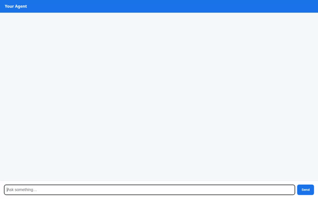

# Atelier Jewelry Concierge 💎✨

An intelligent, AI-powered luxury jewelry assistant built with Google ADK, Vertex AI Gemini, and Agent Engine. It seamlessly combines real-time inventory searching, live currency conversions, sandbox python execution, preference memory persistence, custom AI jewelry image generation, and native A2UI visual cards.



---

## 🌟 Key Features

### 🔍 Firestore Catalog Search (`search_jewelry_catalog`)
- Queries live Firestore inventory to retrieve up-to-date item details, stock levels, materials, and pricing in EUR.
- Returns rich structured product data for luxury rings, necklaces, earrings, and bracelets.

### 💱 Real-Time Currency Conversion (`convert_currency`)
- Fetches live exchange rates using the ExchangeRate API.
- Converts jewelry prices instantly from EUR to any requested currency (USD, GBP, JPY, CAD, AUD, etc.).

### 🎨 Custom AI Jewelry Image Generation (`generate_jewelry_image`)
- Generates high-resolution jewelry design mockups using Vertex AI's `gemini-3.1-flash-lite-image` model.
- Automatically exports generated images to a public Cloud Storage bucket and returns secure `https://` preview URLs.

### 🧪 Python Code Sandbox Execution (`AgentEngineSandboxCodeExecutor`)
- Executes Python code securely in a sandboxed execution environment (`AgentEngineSandboxCodeExecutor`).
- Supports custom calculations, price analytics, and algorithmic queries on demand.

### 🧠 Session Preference Memory Bank (`MemoryService`)
- Integrates with Agent Engine Memory Bank to automatically ingest and retrieve user preferences across sessions.
- Remembers user style preferences, preferred metals, ring sizes, and favorite gemstones.

### 📱 Dynamic Visual Interface (A2UI)
- Built with `A2uiSchemaManager` (v0.8) and `a2ui-agent-sdk`.
- Transforms model output into elegant visual UI cards (Headers, Column/Row layouts, Badges, and Specs) rendered natively in the frontend.

### 🌐 Lightweight FastAPI Proxy Frontend (`frontend/`)
- A minimal FastAPI backend proxy forwarding A2A requests from the web interface to the deployed Agent Engine runtime.
- Includes a responsive web chat UI with a built-in A2UI card renderer.

---

## 🏗️ Architecture

```
User (Browser UI) ──▶ FastAPI Proxy (frontend/) ──▶ Agent Engine (A2A Protocol)
                                                         │
                                  ┌──────────────────────┼──────────────────────┐
                                  ▼                      ▼                      ▼
                         Firestore Inventory   Vertex AI Gemini Model   Memory Bank Service
                                  │                      │
                                  ▼                      ▼
                          ExchangeRate API     Cloud Storage Bucket (Images)
```

---

## 🚀 Running Locally

### Prerequisites
- Python 3.11+
- `uv` or `pip`
- Google Cloud SDK (`gcloud`) with active ADC (`gcloud auth application-default login`)

### 1. Install Dependencies
```bash
uv pip install -r requirements.txt
uv pip install -r frontend/requirements.txt
```

### 2. Start the Agent Playground (Dev UI)
```bash
uv run adk web . --port 8080 --reload_agents
```
Open `http://localhost:8080/dev-ui/?app=app` in your browser.

### 3. Start the FastAPI Proxy Chat Frontend
```bash
export AGENT_ENGINE_RESOURCE_NAME="projects/<PROJECT_ID>/locations/<REGION>/reasoningEngines/<ENGINE_ID>"
export AGENT_DIRECTORY="app"
export PORT=8080
python frontend/main.py
```
Open `http://localhost:8080` to access the chat UI.

---

## 📦 Project Structure

```
atelier-jewelry-concierge/
├── app/
│   ├── agent.py               # Core ADK agent, callbacks, and Memory Bank integration
│   ├── tools.py               # Firestore catalog, exchange rate, and image generation tools
│   ├── a2ui_utils.py          # A2UI catalog card schema and UI builder functions
│   └── GEMINI.md              # System prompt and domain guidance
├── frontend/
│   ├── main.py                # FastAPI proxy server (A2A client)
│   ├── requirements.txt       # Frontend dependencies
│   ├── Dockerfile             # Container configuration for Cloud Run deployment
│   └── static/
│       └── index.html         # Responsive web chat UI & native A2UI renderer
├── demo.gif                   # Demo screen recording
├── pyproject.toml             # Project configuration & python dependencies
├── agents-cli-manifest.yaml   # Deployment manifest
└── deployment_metadata.json   # Remote Agent Engine runtime reference
```
